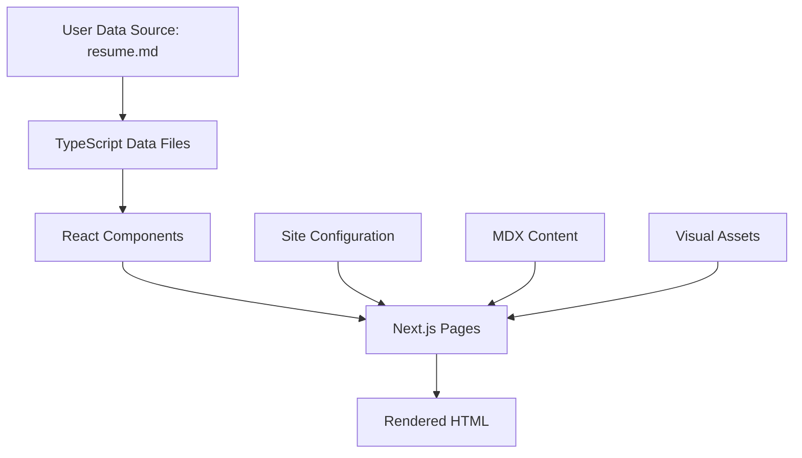

# Design Document: Portfolio Personalization

## Overview

This design document specifies the technical implementation for personalizing the Next.js 16 portfolio website from the original template content to Jaspreet Singh's professional profile. The personalization involves a comprehensive data replacement strategy across multiple layers of the application while preserving the technical architecture, component registry system, and development tooling.

### Scope

The personalization encompasses:
- **User profile data** replacement in TypeScript data files
- **Professional experience** and projects portfolio updates
- **Technical skills** and interests reconfiguration
- **Site configuration** and metadata updates (SEO, Open Graph, social links)
- **Content system** cleanup (blog posts, MDX files, testimonials)
- **Visual assets** removal and placeholder setup
- **Navigation** and routing adjustments
- **Production readiness** verification

### Out of Scope

- Modifying the Next.js 16 App Router architecture
- Changing the shadcn/ui component registry system
- Altering the MDX content processing pipeline
- Modifying the Tailwind CSS v4 styling system
- Changing analytics integration architecture (PostHog, OpenPanel)

### Design Goals

1. **Complete Personalization**: Replace all template content with Jaspreet Singh's authentic professional information
2. **Data Integrity**: Maintain TypeScript type safety and data structure consistency
3. **Production Ready**: Ensure the website builds, passes type checking, and deploys successfully
4. **Maintainability**: Preserve clean code structure for future content additions
5. **SEO Optimization**: Update all metadata for proper search engine indexing

## Architecture

### System Architecture

The portfolio website follows a layered architecture:

```
┌─────────────────────────────────────────────────────────────┐
│                     Presentation Layer                       │
│  (Next.js 16 App Router Pages, React Components, Layouts)   │
└─────────────────────────────────────────────────────────────┘
                              │
┌─────────────────────────────────────────────────────────────┐
│                      Data Access Layer                       │
│     (TypeScript Data Files, MDX Content, API Routes)        │
└─────────────────────────────────────────────────────────────┘
                              │
┌─────────────────────────────────────────────────────────────┐
│                    Configuration Layer                       │
│        (site.ts, package.json, Environment Variables)       │
└─────────────────────────────────────────────────────────────┘
```

### Personalization Strategy

The personalization follows a **data-driven replacement** approach:

1. **Configuration Layer Updates**: Modify `src/config/site.ts`, `package.json`, and environment-related files
2. **Data Layer Replacement**: Update all TypeScript data files in `src/features/portfolio/data/`
3. **Content Layer Cleanup**: Remove original author's MDX blog posts and documentation
4. **Asset Layer Cleanup**: Remove unused images, logos, and branding assets
5. **Verification Layer**: Run build, type checking, and linting to ensure production readiness

### Data Flow



## Components and Interfaces

### Core Data Components

#### 1. User Profile Component (`src/features/portfolio/data/user.ts`)

**Purpose**: Central user identity and profile information

**Interface**:
```typescript
interface User {
  firstName: string
  lastName: string
  displayName: string
  username: string
  gender: string
  pronouns: string
  bio: string
  flipSentences: string[]
  address: string
  phoneNumber: string // base64 encoded
  email: string // base64 encoded
  website: string
  jobTitle: string
  jobs: Job[]
  about: string
  avatar: string
  avatarVariants?: {
    lightOff: string
    lightOn: string
    darkOff: string
    darkOn: string
  }
  ogImage: string
  namePronunciationUrl?: string
  timeZone: string
  keywords: string[]
  dateCreated: string // YYYY-MM-DD
}
```

**Personalization Changes**:
- Replace `firstName`, `lastName`, `displayName` with "Jaspreet", "Singh", "Jaspreet Singh"
- Update `username` to appropriate value (e.g., "jaspreetsingh")
- Change `jobTitle` to "Backend/Platform Engineer"
- Update `bio` and `flipSentences` to reflect backend engineering focus
- Change `address` to "Rajpura, Punjab, India"
- Update `phoneNumber` (base64: "+91-8847027963") and `email` (base64: "jaspreet.singh.tech@gmail.com")
- Replace `avatar` and `ogImage` URLs with placeholders
- Update `keywords` array with Jaspreet Singh-related terms
- Remove `namePronunciationUrl` or update if provided

#### 2. Experience Component (`src/features/portfolio/data/experiences.tsx`)

**Purpose**: Professional work history and education

**Interface**:
```typescript
interface Experience {
  id: string
  companyName: string
  companyLogo: string
  companyWebsite?: string
  positions: Position[]
  isCurrentEmployer?: boolean
}

interface Position {
  id: string
  title: string
  employmentPeriod: {
    start: string // MM.YYYY
    end?: string // MM.YYYY
  }
  employmentType?: string
  icon?: ReactNode
  description?: string
  skills?: string[]
  isExpanded?: boolean
}
```

**Personalization Changes**:
- Replace all experiences with Jaspreet Singh's work history:
  - Protokol.io (Native Teams): Backend/Full Stack Engineer (Apr 2024 - Present)
  - Aerchain: Backend Developer (Dec 2023 - Mar 2024)
- Update education section with Chitkara Institute details
- Remove all original experiences (Simplamo, Quaric, shadcncraft, Tung Tung, Freelance)

#### 3. Projects Component (`src/features/portfolio/data/projects.ts`)

**Purpose**: Personal projects portfolio

**Interface**:
```typescript
interface Project {
  id: string
  title: string
  period: {
    start: string // MM.YYYY
    end?: string // MM.YYYY
  }
  link?: string
  skills: string[]
  description: string
  logo?: string
  isExpanded?: boolean
}
```

**Personalization Changes**:
- Replace all projects with:
  - Local LLM Home Server (vLLM, Docker, GPU acceleration)
  - Trello Clone (Node.js, Express, React, Redux, PostgreSQL)
- Remove all original projects (React Wheel Picker, chanhdai.com, ZaDark, etc.)

#### 4. Tech Stack Component (`src/features/portfolio/data/tech-stack.ts`)

**Purpose**: Technical skills and tools

**Interface**:
```typescript
interface TechStack {
  key: string
  title: string
  href: string
  categories: string[]
  theme?: boolean
}
```

**Personalization Changes**:
- Update to include Jaspreet Singh's tech stack:
  - Languages: JavaScript, TypeScript, Python, C/C++, Go, HTML, CSS
  - Frameworks: Node.js, Express.js, React.js, Vue.js, TanStack, Shadcn/UI, Sequelize
  - Backend: Webpack, Babel, RabbitMQ, Redis, Braintree, Stripe, Postman
  - Databases: MongoDB, MySQL, PostgreSQL
  - DevOps: Docker, Docker Compose, Git, vLLM, llama.cpp, OpenAI APIs
- Remove technologies not relevant to Jaspreet Singh's profile

#### 5. Social Links Component (`src/features/portfolio/data/social-links.ts`)

**Purpose**: Social media and professional network links

**Interface**:
```typescript
interface SocialLink {
  icon: string
  title: string
  subtitle: string
  href: string
}
```

**Personalization Changes**:
- Replace with Jaspreet Singh's links:
  - GitHub: https://sink.jaspreet-singh-true.workers.dev/github/test1234
  - LinkedIn: https://sink.jaspreet-singh-true.workers.dev/jaspreet-singh-linkedin/test1234
  - Email: mailto:jaspreet.singh.tech@gmail.com
- Remove original social links (X, daily.dev, Discord, YouTube)

#### 6. Site Configuration Component (`src/config/site.ts`)

**Purpose**: Global site configuration and constants

**Key Exports**:
```typescript
export const SITE_INFO: {
  name: string
  url: string
  ogImage: string
  description: string
  keywords: string[]
}

export const MAIN_NAV: NavItem[]
export const MOBILE_NAV: NavItem[]
export const X_HANDLE: string
export const GITHUB_USERNAME: string
export const SOURCE_CODE_GITHUB_REPO: string
export const SPONSORSHIP_URL: string
```

**Personalization Changes**:
- Update `SITE_INFO` to use Jaspreet Singh's data from USER object
- Update `X_HANDLE` and `GITHUB_USERNAME` to Jaspreet Singh's handles (or remove if not applicable)
- Update `SOURCE_CODE_GITHUB_REPO` to appropriate repository
- Remove or update `SPONSORSHIP_URL`
- Adjust `MAIN_NAV` to remove "Sponsors" if not applicable

### Supporting Components

#### 7. Awards and Certifications (`src/features/portfolio/data/awards.ts`, `certifications.ts`)

**Personalization Changes**:
- Remove all original author's awards and certifications
- Add Jaspreet Singh's academic references:
  - GitLab Projects at MountBlue (2022)
  - IEEE Research: Augmented Reality in Education (2023)
  - IoT Projects (2024-25)

#### 8. Testimonials (`src/features/portfolio/data/testimonials.ts`)

**Personalization Changes**:
- Remove all template testimonials
- Leave empty array or add authentic testimonials if provided by Jaspreet Singh

#### 9. Bookmarks (`src/features/portfolio/data/bookmarks.tsx`)

**Personalization Changes**:
- Review existing bookmarks (design resources, web guidelines, animation tips)
- Keep bookmarks that are relevant to Jaspreet Singh's interests (platform engineering, developer tooling)
- Remove or replace bookmarks that are design-focused if not aligned with backend engineering focus
- Add new bookmarks related to backend, platform engineering, or DevOps if desired

## Data Models

### User Profile Data Model

```typescript
// Source: resume.md
const JASPREET_SINGH_PROFILE = {
  personalInfo: {
    firstName: "Jaspreet",
    lastName: "Singh",
    displayName: "Jaspreet Singh",
    username: "jaspreetsingh", // or appropriate username
    jobTitle: "Backend/Platform Engineer",
    location: "Rajpura, Punjab, India",
    phoneNumber: "Kzk0LTg4NDcwMjc5NjM=", // base64 encoded "+91-8847027963"
    email: "amFzcHJlZXQuc2luZ2gudGVjaEBnbWFpbC5jb20=", // base64 encoded
    timeZone: "Asia/Kolkata",
  },
  
  professionalSummary: {
    bio: "Backend/Platform Engineer specializing in payment integrations, developer tooling, and scalable systems.",
    flipSentences: [
      "Backend/Platform Engineer",
      "Payment Gateway Integration Specialist",
      "Developer Tooling Enthusiast",
    ],
    about: `Backend/Platform Engineer with expertise in payment gateway integrations (Stripe, Braintree), 
developer tooling, and scalable backend systems. Passionate about platform engineering, 
embedded systems, and CI/CD automation.`,
    interests: [
      "Platform Engineering",
      "Developer Tooling",
      "Embedded Systems",
      "Edge Computing",
      "Virtual Machines",
      "CI/CD",
    ],
  },
  
  education: {
    degree: "Bachelor of Technology in Computer Science and Engineering",
    institution: "Chitkara Institute of Engineering and Technology, Punjab",
    period: "2020-2024",
    cgpa: 9.1,
  },
  
  socialLinks: {
    github: "https://sink.jaspreet-singh-true.workers.dev/github/test1234",
    linkedin: "https://sink.jaspreet-singh-true.workers.dev/jaspreet-singh-linkedin/test1234",
    email: "mailto:jaspreet.singh.tech@gmail.com",
  },
  
  seoKeywords: [
    "Jaspreet Singh",
    "Backend Engineer",
    "Platform Engineer",
    "Rajpura",
    "Punjab",
    "Stripe Integration",
    "Braintree Integration",
    "Node.js Developer",
    "Go Developer",
    "Docker",
    "Webpack",
  ],
}
```

### Experience Data Model

```typescript
const PROTOKOL_EXPERIENCE = {
  id: "protokol",
  companyName: "Protokol.io (Native Teams)",
  companyLogo: "", // placeholder or remove
  companyWebsite: "https://protokol.io",
  positions: [{
    id: "1",
    title: "Backend/Full Stack Engineer",
    employmentPeriod: {
      start: "04.2024",
    },
    employmentType: "Remote",
    description: `
- Integrated Stripe payment gateway in Go with transaction lifecycle, refunds, and webhook-based verification
- Integrated Braintree (PayPal) payment gateway in Go with refund, void, and resync operations
- Designed Node.js CLI-based hot-reload system using Commander.js for 10-15 engineers
- Implemented incremental compilation with WebSocket-based real-time updates
- Developed and maintained SDKs using Webpack, Babel, and TypeScript for 8-9 production applications
- Built database-agnostic admin platform supporting MongoDB and MySQL with 50+ operations
- Containerized services using Docker and docker-compose
    `,
    skills: [
      "Go",
      "Stripe",
      "Braintree",
      "PayPal",
      "Node.js",
      "Commander.js",
      "WebSocket",
      "Chokidar",
      "Webpack",
      "Babel",
      "TypeScript",
      "MongoDB",
      "MySQL",
      "TanStack Router",
      "TanStack Table",
      "TanStack Query",
      "Shadcn/UI",
      "React",
      "Docker",
      "Docker Compose",
    ],
    isExpanded: true,
  }],
  isCurrentEmployer: true,
}

const AERCHAIN_EXPERIENCE = {
  id: "aerchain",
  companyName: "Aerchain",
  companyLogo: "", // placeholder or remove
  positions: [{
    id: "1",
    title: "Backend Developer",
    employmentPeriod: {
      start: "12.2023",
      end: "03.2024",
    },
    employmentType: "On-site",
    description: `
- Developed custom login mechanisms for SAP and Aerchain synchronization
- Created custom tools to streamline development and testing workflows
- Worked with Node.js, PostgreSQL, Sequelize, Express.js, and Postman
- Refactored codebase with generic variables for improved maintainability
    `,
    skills: [
      "Node.js",
      "PostgreSQL",
      "Sequelize",
      "Express.js",
      "Postman",
      "SAP Integration",
    ],
  }],
}
```

### Projects Data Model

```typescript
const LOCAL_LLM_PROJECT = {
  id: "local-llm-server",
  title: "Local LLM Home Server",
  period: {
    start: "2024", // approximate
  },
  skills: [
    "vLLM",
    "Docker",
    "Docker Compose",
    "Open WebUI",
    "llama.cpp",
    "GPU Acceleration",
    "AMD RX 6750 XT",
  ],
  description: `Self-hosted LLM inference system with GPU acceleration and containerized deployment.
- Built self-hosted LLM inference server using vLLM with GPU acceleration on AMD RX 6750 XT
- Designed multi-service architecture using Docker and Docker Compose
- Integrated Open WebUI for model interaction
- Implemented dynamic model loading and unloading`,
}

const TRELLO_CLONE_PROJECT = {
  id: "trello-clone",
  title: "Trello Clone",
  period: {
    start: "2023", // approximate
  },
  link: "https://sink.jaspreet-singh-true.workers.dev/trello-clone-vercel/test1234",
  skills: [
    "Node.js",
    "Express.js",
    "Sequelize ORM",
    "PostgreSQL",
    "React",
    "Redux",
    "MUI",
  ],
  description: `Trello-inspired task management application built as a full-stack development project.
- Developed task and workflow management system
- Implemented React-based frontend with Redux state management
- Built backend APIs with Express.js and PostgreSQL integration
- Gained deeper understanding of state management paradigms and full-stack architecture`,
  isExpanded: true,
}
```

## Error Handling

### Data Validation

**Strategy**: Implement TypeScript strict type checking to catch data inconsistencies at compile time.

**Error Scenarios**:
1. **Missing Required Fields**: TypeScript will flag missing required properties in data objects
2. **Type Mismatches**: Incorrect data types will be caught during type checking
3. **Invalid Date Formats**: Period dates must follow "MM.YYYY" format
4. **Broken URLs**: Social links and project URLs should be validated during build

**Handling Approach**:
- Run `pnpm check-types` after all data changes
- Use TypeScript's strict mode to enforce type safety
- Validate base64 encoded strings (phone, email) are properly formatted
- Ensure all external URLs are accessible (manual verification)

### Build-Time Errors

**Strategy**: Comprehensive build verification before deployment.

**Error Scenarios**:
1. **Import Errors**: Missing or incorrect imports in data files
2. **MDX Parsing Errors**: Malformed MDX content
3. **Asset Loading Errors**: Missing images or assets referenced in code
4. **Registry Build Errors**: Issues with shadcn registry generation

**Handling Approach**:
- Run `pnpm build` to catch all build-time errors
- Run `pnpm lint` to catch code quality issues
- Run `pnpm registry:build` to verify registry integrity
- Fix errors iteratively until clean build is achieved

### Runtime Errors

**Strategy**: Graceful degradation for missing optional data.

**Error Scenarios**:
1. **Missing Avatar Images**: Use placeholder or initials
2. **Missing Company Logos**: Use generic company icon
3. **Missing Optional Fields**: Render without the optional content
4. **Broken External Links**: Display link but don't break page

**Handling Approach**:
- Use optional chaining (`?.`) for optional properties
- Provide fallback values for critical display fields
- Implement error boundaries for component-level failures
- Log errors to console for debugging

## Testing Strategy

### Manual Testing Approach

Since this is a data replacement task without complex business logic, the testing strategy focuses on **manual verification** and **build validation** rather than automated tests.

#### 1. Data Integrity Testing

**Objective**: Verify all data has been correctly replaced

**Test Cases**:
- [ ] User profile displays "Jaspreet Singh" throughout the website
- [ ] Job title shows "Backend/Platform Engineer"
- [ ] Location shows "Rajpura, Punjab, India"
- [ ] Contact information (phone, email) is correct and properly encoded
- [ ] Education shows Chitkara Institute with CGPA 9.1
- [ ] All original author references are removed

**Method**: Manual inspection of rendered pages

#### 2. Experience Section Testing

**Objective**: Verify work experience is correctly displayed

**Test Cases**:
- [ ] Protokol.io experience shows correct position and dates
- [ ] Protokol.io is marked as current employer
- [ ] Aerchain experience shows correct position and dates
- [ ] All responsibilities and skills are displayed correctly
- [ ] Original experiences (Simplamo, Quaric, etc.) are removed

**Method**: Navigate to experience/about page and verify content

#### 3. Projects Section Testing

**Objective**: Verify projects portfolio is correctly displayed

**Test Cases**:
- [ ] Local LLM Home Server project is displayed with correct details
- [ ] Trello Clone project is displayed with correct details and link
- [ ] All original projects are removed
- [ ] Project links are functional
- [ ] Skills tags are correctly displayed

**Method**: Navigate to projects page and verify content

#### 4. Technical Skills Testing

**Objective**: Verify tech stack is correctly displayed

**Test Cases**:
- [ ] All Jaspreet Singh's technologies are listed
- [ ] Technologies are correctly categorized
- [ ] Original author's exclusive technologies are removed
- [ ] Links to technology websites are functional

**Method**: Navigate to tech stack section and verify content

#### 5. Social Links Testing

**Objective**: Verify social links are correctly updated

**Test Cases**:
- [ ] GitHub link points to Jaspreet Singh's profile
- [ ] LinkedIn link points to Jaspreet Singh's profile
- [ ] Email link is correct
- [ ] Original social links (X, daily.dev, Discord, YouTube) are removed
- [ ] All links are functional

**Method**: Click each social link and verify destination

#### 6. SEO and Metadata Testing

**Objective**: Verify SEO metadata is correctly updated

**Test Cases**:
- [ ] Page title includes "Jaspreet Singh"
- [ ] Meta description reflects Jaspreet Singh's profile
- [ ] Open Graph tags show correct name and bio
- [ ] Keywords include Jaspreet Singh-related terms
- [ ] Favicon and og:image are updated or use placeholders

**Method**: Inspect page source and meta tags

#### 7. Navigation Testing

**Objective**: Verify navigation works correctly

**Test Cases**:
- [ ] All navigation links are functional
- [ ] Removed sections (sponsors, testimonials) are not in navigation
- [ ] Mobile navigation works correctly
- [ ] Breadcrumbs are correct

**Method**: Navigate through all pages on desktop and mobile

#### 8. Content Cleanup Testing

**Objective**: Verify original content is removed

**Test Cases**:
- [ ] Original blog posts are removed
- [ ] Original testimonials are removed
- [ ] Original awards/certifications are removed
- [ ] Original project logos are removed
- [ ] Original avatar images are removed

**Method**: Search codebase and verify files are deleted

#### 9. Build Verification Testing

**Objective**: Verify the website builds successfully

**Test Cases**:
- [ ] `pnpm build` completes without errors
- [ ] `pnpm check-types` passes without errors
- [ ] `pnpm lint` passes without errors
- [ ] `pnpm registry:build` completes successfully
- [ ] Development server starts without errors

**Method**: Run each command and verify success

#### 10. Production Deployment Testing

**Objective**: Verify the website is production-ready

**Test Cases**:
- [ ] Website loads correctly in production environment
- [ ] All pages are accessible
- [ ] Images and assets load correctly
- [ ] Dark/light theme switching works
- [ ] Responsive design works on all device sizes
- [ ] Analytics integration works (if configured)

**Method**: Deploy to staging/production and verify

### Testing Checklist Summary

```markdown
## Pre-Deployment Checklist

### Data Verification
- [ ] All user profile data updated
- [ ] All experience data updated
- [ ] All projects data updated
- [ ] All tech stack data updated
- [ ] All social links updated
- [ ] All site configuration updated

### Content Cleanup
- [ ] Original blog posts removed
- [ ] Original testimonials removed
- [ ] Original awards removed
- [ ] Original images removed
- [ ] Original branding removed

### Build Verification
- [ ] TypeScript type checking passes
- [ ] ESLint passes
- [ ] Production build succeeds
- [ ] Registry build succeeds
- [ ] No console errors in development

### Functional Verification
- [ ] All pages load correctly
- [ ] All links are functional
- [ ] Navigation works correctly
- [ ] Theme switching works
- [ ] Responsive design works
- [ ] SEO metadata is correct

### Production Readiness
- [ ] README.md updated
- [ ] package.json updated
- [ ] Environment variables configured
- [ ] Analytics configured (if applicable)
- [ ] Deployment successful
```

## Implementation Plan

### Phase 1: Configuration Layer Updates

**Files to Modify**:
1. `package.json`
   - Update `name`, `description`, `homepage`
   - Update `author` object with Jaspreet Singh's details
   - Update `repository` URL

2. `src/config/site.ts`
   - Update `X_HANDLE`, `GITHUB_USERNAME`
   - Update `SOURCE_CODE_GITHUB_REPO`
   - Remove or update `SPONSORSHIP_URL`
   - Adjust `MAIN_NAV` (remove "Sponsors" if not applicable)

### Phase 2: Data Layer Replacement

**Files to Modify**:
1. `src/features/portfolio/data/user.ts`
   - Replace entire USER object with Jaspreet Singh's data
   - Update all personal information fields
   - Update avatar URLs to placeholders
   - Update keywords array

2. `src/features/portfolio/data/experiences.tsx`
   - Replace EXPERIENCES array with Protokol.io and Aerchain
   - Add education section with Chitkara Institute
   - Remove all original experiences

3. `src/features/portfolio/data/projects.ts`
   - Replace PROJECTS array with Local LLM Server and Trello Clone
   - Remove all original projects

4. `src/features/portfolio/data/tech-stack.ts`
   - Update TECH_STACK array with Jaspreet Singh's technologies
   - Remove technologies not relevant to his profile

5. `src/features/portfolio/data/social-links.ts`
   - Replace SOCIAL_LINKS array with Jaspreet Singh's links
   - Remove original social links

6. `src/features/portfolio/data/awards.ts`
   - Remove original awards
   - Add academic references (GitLab, IEEE, IoT projects)

7. `src/features/portfolio/data/certifications.ts`
   - Remove original certifications
   - Leave empty or add if Jaspreet Singh has certifications

8. `src/features/portfolio/data/testimonials.ts`
   - Remove original testimonials
   - Leave empty array

### Phase 3: Content Layer Cleanup

**Files to Remove**:
1. Remove all blog post MDX files in `src/features/doc/content/` that are authored by original author
2. Keep only component documentation if registry is being maintained
3. Update `welcome.mdx` or about page with Jaspreet Singh's information

**Files to Modify**:
1. Update any MDX files that reference the original author
2. Update about/bio pages with Jaspreet Singh's content

### Phase 4: Asset Layer Cleanup

**Files to Remove**:
1. Remove unused avatar images
2. Remove company logos not associated with Jaspreet Singh's employers
3. Remove project logos for removed projects
4. Remove sponsor logos and branding

**Files to Update**:
1. Update or remove Open Graph images
2. Update or remove favicon if branded
3. Update or remove references to "https://assets.chanhdai.com" URLs in:
   - Registry components (e.g., duck-follower sprite sheets)
   - Registry examples (e.g., haptic demos, slide-to-unlock demos)
   - Brand assets menu demos

**Registry Examples to Update**:
1. `src/registry/examples/github-contributions-demo-*.tsx` - Update GITHUB_USERNAME and GITHUB_PROFILE_URL
2. `src/registry/examples/glow-card-grid-demo-*.tsx` - Remove original author's name, handle, and avatar
3. `src/registry/examples/middle-truncation-demo.tsx` - Update file path examples
4. `src/registry/examples/github-stars-demo.tsx` - Update repository reference
5. `src/registry/examples/brand-assets-menu-demo.tsx` - Update brand guidelines and assets URLs
6. `src/registry/examples/code-block-command-*.tsx` - Update registry name from "@ncdai" to appropriate value
7. `src/registry/examples/work-experience-demo.tsx` - Update with Jaspreet Singh's experience or use generic example
8. `src/registry/examples/slide-to-unlock-demo-*.tsx` - Update or remove asset URLs
9. `src/registry/examples/haptic-demo.tsx` - Update or remove asset URLs

**Registry Metadata to Update**:
1. `src/registry/index.ts` - Update registry name from "ncdai" to appropriate value
2. `src/registry/index.ts` - Update homepage from "https://chanhdai.com/components" to appropriate URL

### Phase 5: Verification and Testing

**Steps**:
1. Run `pnpm check-types` - verify no type errors
2. Run `pnpm lint` - verify no linting errors
3. Run `pnpm registry:build` - verify registry builds successfully
4. Run `pnpm build` - verify production build succeeds
5. Run `pnpm dev` - verify development server starts
6. Manual testing of all pages and functionality
7. Verify SEO metadata in page source
8. Test responsive design on multiple devices
9. Verify all links are functional
10. Deploy to staging and verify

### Phase 6: Documentation Updates

**Files to Modify**:
1. `README.md`
   - Update project description
   - Update author information
   - Remove original author's badges/links
   - Update deployment instructions if needed

2. `DEVELOPMENT.md` (if exists)
   - Update contributor information

3. `LICENSE` (if applicable)
   - Update copyright holder if needed

## Deployment Considerations

### Environment Variables

**Required Updates**:
- `APP_URL`: Update to Jaspreet Singh's domain (if different)
- Analytics keys (PostHog, OpenPanel): Update or remove if not using
- Any API keys: Update or remove as needed

### Build Configuration

**Verification Steps**:
1. Ensure `next.config.ts` doesn't have hardcoded original author references
2. Verify `tailwind.config.ts` doesn't have custom branding
3. Check `components.json` for any author-specific configuration

### Deployment Platform

**Vercel Deployment** (if using):
1. Update project name in Vercel dashboard
2. Update environment variables in Vercel
3. Update domain configuration
4. Verify build succeeds in Vercel

**Alternative Platforms**:
- Ensure platform-specific configuration is updated
- Update deployment scripts if needed

## Maintenance and Future Additions

### Adding New Content

**Blog Posts**:
1. Create new MDX file in `src/features/doc/content/`
2. Add frontmatter with `category: "blog"`
3. Include `title`, `description`, `createdAt`, `updatedAt`
4. Content will automatically appear in blog section

**Projects**:
1. Add new project object to `PROJECTS` array in `src/features/portfolio/data/projects.ts`
2. Follow existing interface structure
3. Include all required fields

**Experience**:
1. Add new experience to `EXPERIENCES` array in `src/features/portfolio/data/experiences.tsx`
2. Update `isCurrentEmployer` flag as needed
3. Follow existing interface structure

### Updating Personal Information

**Contact Information**:
1. Update `USER` object in `src/features/portfolio/data/user.ts`
2. Remember to base64 encode phone and email

**Social Links**:
1. Update `SOCIAL_LINKS` array in `src/features/portfolio/data/social-links.ts`
2. Add new platforms as needed

**Technical Skills**:
1. Update `TECH_STACK` array in `src/features/portfolio/data/tech-stack.ts`
2. Categorize appropriately

## Conclusion

This design document provides a comprehensive technical specification for personalizing the Next.js 16 portfolio website for Jaspreet Singh. The implementation follows a systematic data replacement approach across configuration, data, content, and asset layers while preserving the technical architecture and ensuring production readiness.

The design emphasizes:
- **Type safety** through TypeScript strict mode
- **Data integrity** through structured data models
- **Production readiness** through comprehensive build verification
- **Maintainability** through clean code structure and documentation

By following this design, the portfolio will be completely personalized to Jaspreet Singh's professional profile while maintaining the high-quality technical foundation of the original template.
